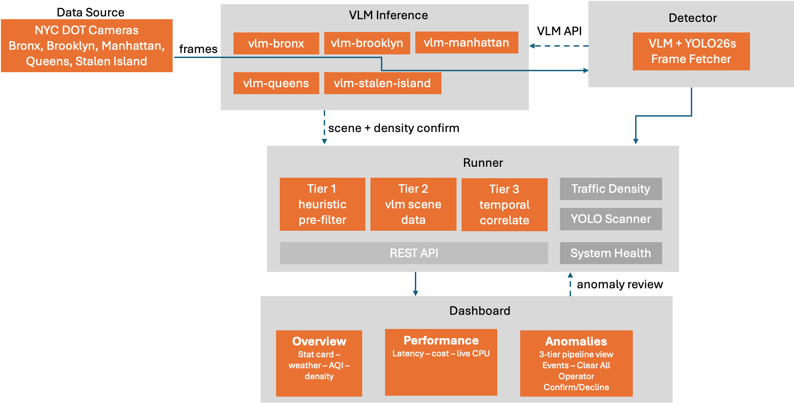

# Smart City Video Intelligence
## User Interface
This is a Smart City traffic monitoring demo built as an edge computing showcasing live traffic cameras across 5 areas in New York City - real time accidents, obstruction, and crowd detection plus traffic density - all running on Arm64 Ampere processor, zero GPUs, no cloud inference.
The dashboard includes three tabs:

**Overview - the main view:**

- Stat cards shows anomalies, latency, pedestrians, vehicles, and no GPU
- Top 5 busiest cameras at live feeds with YOLO bounding boxes ranked by traffic.
- Camera grid in 5 areas that toggles every 30s between a camera list and an animated rolling summary report with weather, air quality, etc.
- Charts of vehicle flow by area, traffic density
- NYC weather, air quality 
- System health gauges 
- Recent anomalies table

**Performance** - summary cards, a 3-tier pipeline visualization, and a full events table with “Clear All”

**Camera modal** (click any camera) - live feed with synced YOLO boxes plus a side panel showing camera detail, weather, air quality mini chart, VLM-confirmed density/flow, and per-anomaly confirm/decline operator-review buttons.


## Architectural Diagram
Below is the architectural diagram which visualize the smart city video intelligence in New York:



## What This Demo Shows

The demo shows a live traffic operations dashboard for NYC.  On screen you see:
**On the dashboard** (the visible demo)
- Live NYC Dot camera feeds across 5 areas, with YOLO bounding boxes drawn on vehicles and pedestrians in real time
- Top 5 busiest cameras ranked live by traffic.
- Detected anomalies  - accidents, road constructions, and crowds 
- Traffic density per area (free flow, congested, etc) confirmed visually by the AI
- Per area situation reports (weather, AQ, density, anomalies)
- System health

What it is demonstrating 
- Real time multi camera AI vision for on CPU, no GPU required
- A mart pipeline beats brute force - a 3-tier funnel (heuristic → VLM → temporal tracking) gives both accuracy and throughput by only sending ~10% of frames to the expensive model.
- Human-in-the-loop operations - operators can Confirm?Decline anomalies, with smart per-object suppression.
- The same workload at a fraction of GPU/cloud cost, scaling linearly with cores rather than accelerators.

## Target Audience

This is fundamentally an Ampere Computing edge-compute showcase the underlying sell across every audience is that demanding vision-AI workloads run economically on Arm64 Ampere CPUs
- Technical leaders / Engineering decision-makers 
  - Want the how: the 3-tier pipeline, Qwen2.5-VL 3B running on Ampere’s optimized llama.cpp, area isolation, latency characteristics 
- Edge compute buyer / TCO-focused stakeholders
  - Want the cost story:  the performance vs cost
- Municipal / transit / government stakeholders 
  - Want the outcome:  real NYC cameras, real time accidents, crowd detections, operator review workflow, 

## Key Message - What are we trying to convince of?

**Core message** 
demanding, real-time computer vision AI - at municipal scale - runs economically on commodity Arm64 processors.  You don’t need GPUs or the cloud.  
- It’s real - not a canned demo:  Live NYC DOT feeds, live weather, live AQ - every number on screen comes from a real source, refreshing in real time.
- It’s CPU-only: Five vision language models running in parallel on a single Arm64 server.  No GPU, no cloud inference
- It’s a pipeline, not a model:  it is feasible and affordable.  A 3 tier funnel (heuristics → VLM → temporal tracking) throws away ~90% of frames before the expensive model, giving accuracy and throughput plus a human intervention review step.  The architecture scales linearly with CPU cores, not accelerators - more cameras means more cores, not more GPUs.  The same workload at a fraction of the GPU cost.  
- So we’re convincing that edge AI economics favor Arm64 processors, and the live NYC traffic systems is the evidence.

## Proof Points - How does It Show This?

The Overview tab is a proof point - live DOT camera running in 5 different areas, 3 anomaly types, traffic density, weather Air Quality, and system health - all live, simultaneously on a Arm64 server.  
- It’s CPU only - no GPU
  - 8 live containers, all CPU pinned: Performance tab → pipeline diagram with live per-container CPU bars updating every 3s (5 VLM, detector, runner, and dashboard)
  - The cost consequence : Performance tab with cost comparison
 
- It’s real - live
  - Live camera feeds: Top 5 busiest strip - watch YOLO bounding boxes refresh in real time
  - Live weather + AQ: NYC weather strip and AQ section - pulled from Open-Metro per area
  - Live aggregation: Area summary reports 

- It’s a pipeline, not model
  - The 3 tiers are visible : 3 tier confidence breakdown per event
  - The funnel works: frame processed vs. anomalies detected - the gap proves ~90% of frames get filtered before the VLM.
  - VLM actually see: Density is dual confirmed.  PCE 40% + VLM 60%, shown as a confirmed density level per camera
  - Temporal lifecycle: incidents must persist across frames, not fire on one frame.
 
- Human intervention / Production Ready Ops
  - Operator review: Click any camera to Confirm/Decline buttons on anomalies
  - Resilience: If VLM drops, the other keep running.
 
The audience can watch what happened live - the CPU bars (not GPU), the refreshing feeds (real time), the expandable tier breakdown (pipeline), and the spatial decline (ops).  The presenter isn’t asserting any claims, the dashboard demonstrates each one in real time.

## Running the Demo

**Recommended Resources**

- Minimum: 64 cores. Recommended: 64+ cores
- Minimum: 64GB RAM. Recommended: 64+ GB RAM
- Minimum: 20GB disk space. Recommended: 100+ GB (multiple models, large models)

**Software Stack**

Inference/Models
- Qwen2.5-VL 3B Instruct: Vision language model - Tier 2 anomaly confirm + density confirm
- YOLOv26s -  Object detection (vehicles/persons), weather-adaptive preprocessing
- amperecomputingai/llama.cpp:3.4.2-ampereone -  ampere optimized build

Backend (detector + runner)

- Python 3.13
- httpx:0.27+ - Async http - camera feeds, VLM api
- Pillow:10.0+ - Frame decode / downscale to 384px
- NumPy:1.24+ - Array ops for YOLO pre and post processing
- pandas + openpyxl:2.0+ / 3.1 + - Read xlsx camera registry.

Frontend (Dashboard)

- React:19.1 - dashboard UI
- Recharts:2.15.3 - Charts (vehicle flow, density, AQI)

Infrastructure 

- Docker Engine / Compose:24+. / v.2 - container orchestration
- Docker Engine api - Per container CPU stats for system health panel

External API

- NYC DOT camera feeds  - live camera frames for NYC
- Open-Meteo Weather API - weather for 5 areas in NYC
- Open-Meteo Air Quality API - US AQI + PM2.5

**Demo Deployment**
- Install docker 
- Git clone from the repo:  
- Download the Ampere optimized model from Hugging Face.
  - qwen-2.5-vl-3b-instruct-Q8R16.gguf
  - mmproj-qwen-2.5-vl-3b-instruct-Q8_0.gguf
- Place the model inside the models/ directory.
- docker-compose.yaml
```yaml
# =============================================================================
# Smart City — 5 VLM instances (one per borough) + detector
# Total: 60 CPU cores for VLM (12 each) + detector container
#
# Usage:
#   docker compose build
#   docker compose up -d              # continuous detection loop
#   docker compose up -d --build      # build images and start in background
#   docker compose up                 # foreground with logs
#   docker compose run detector --once  # single pass then exit
#   docker compose down               # stop everything
# =============================================================================

services:
  # ──────────────────────────────────────────────────────────────
  # VLM Instances — Qwen2.5-VL 3B via llama-server
  # Each instance: 10 threads, pinned to dedicated CPU cores
  # ──────────────────────────────────────────────────────────────

  vlm-bronx:
    build:
      context: ./docker/llama-server
      dockerfile: Dockerfile
    container_name: smartcity-vlm-bronx
    ports:
      - "18080:8080"
    volumes:
      - ./models:/models:ro
    command: >
      --model /models/qwen2.5-vl/qwen-2.5-vl-3b-instruct-Q8R16.gguf
      --mmproj /models/qwen2.5-vl/mmproj-qwen-2.5-vl-3b-instruct-Q8_0.gguf
      --host 0.0.0.0
      --port 8080
      -t 12
      -c 2048
      -n 256
      --metrics
      --batch-size 512
      --flash-attn on
    cpuset: "120-131"
    restart: unless-stopped
    healthcheck:
      test: ["CMD", "curl", "-f", "http://localhost:8080/health"]
      interval: 15s
      timeout: 5s
      retries: 10
      start_period: 120s
    networks:
      - smartcity

  vlm-brooklyn:
    build:
      context: ./docker/llama-server
      dockerfile: Dockerfile
    container_name: smartcity-vlm-brooklyn
    ports:
      - "18081:8080"
    volumes:
      - ./models:/models:ro
    command: >
      --model /models/qwen2.5-vl/qwen-2.5-vl-3b-instruct-Q8R16.gguf
      --mmproj /models/qwen2.5-vl/mmproj-qwen-2.5-vl-3b-instruct-Q8_0.gguf
      --host 0.0.0.0
      --port 8080
      -t 12
      -c 2048
      -n 256
      --metrics
      --batch-size 512
      --flash-attn on
    cpuset: "132-143"
    restart: unless-stopped
    healthcheck:
      test: ["CMD", "curl", "-f", "http://localhost:8080/health"]
      interval: 15s
      timeout: 5s
      retries: 10
      start_period: 120s
    networks:
      - smartcity

  vlm-manhattan:
    build:
      context: ./docker/llama-server
      dockerfile: Dockerfile
    container_name: smartcity-vlm-manhattan
    ports:
      - "18082:8080"
    volumes:
      - ./models:/models:ro
    command: >
      --model /models/qwen2.5-vl/qwen-2.5-vl-3b-instruct-Q8R16.gguf
      --mmproj /models/qwen2.5-vl/mmproj-qwen-2.5-vl-3b-instruct-Q8_0.gguf
      --host 0.0.0.0
      --port 8080
      -t 12
      -c 2048
      -n 256
      --metrics
      --batch-size 512
      --flash-attn on
    cpuset: "144-155"
    restart: unless-stopped
    healthcheck:
      test: ["CMD", "curl", "-f", "http://localhost:8080/health"]
      interval: 15s
      timeout: 5s
      retries: 10
      start_period: 120s
    networks:
      - smartcity

  vlm-queens:
    build:
      context: ./docker/llama-server
      dockerfile: Dockerfile
    container_name: smartcity-vlm-queens
    ports:
      - "18083:8080"
    volumes:
      - ./models:/models:ro
    command: >
      --model /models/qwen2.5-vl/qwen-2.5-vl-3b-instruct-Q8R16.gguf
      --mmproj /models/qwen2.5-vl/mmproj-qwen-2.5-vl-3b-instruct-Q8_0.gguf
      --host 0.0.0.0
      --port 8080
      -t 12
      -c 2048
      -n 256
      --metrics
      --batch-size 512
      --flash-attn on
    cpuset: "156-167"
    restart: unless-stopped
    healthcheck:
      test: ["CMD", "curl", "-f", "http://localhost:8080/health"]
      interval: 15s
      timeout: 5s
      retries: 10
      start_period: 120s
    networks:
      - smartcity

  vlm-staten-island:
    build:
      context: ./docker/llama-server
      dockerfile: Dockerfile
    container_name: smartcity-vlm-staten-island
    ports:
      - "18084:8080"
    volumes:
      - ./models:/models:ro
    command: >
      --model /models/qwen2.5-vl/qwen-2.5-vl-3b-instruct-Q8R16.gguf
      --mmproj /models/qwen2.5-vl/mmproj-qwen-2.5-vl-3b-instruct-Q8_0.gguf
      --host 0.0.0.0
      --port 8080
      -t 12
      -c 2048
      -n 256
      --metrics
      --batch-size 512
      --flash-attn on
    cpuset: "168-179"
    restart: unless-stopped
    healthcheck:
      test: ["CMD", "curl", "-f", "http://localhost:8080/health"]
      interval: 15s
      timeout: 5s
      retries: 10
      start_period: 120s
    networks:
      - smartcity

  # ──────────────────────────────────────────────────────────────
  # Detector — Python app that fetches frames and queries VLMs
  # ──────────────────────────────────────────────────────────────

  detector:
    build:
      context: .
      dockerfile: docker/detector/Dockerfile
    container_name: smartcity-detector
    volumes:
      - ./output:/app/output
      - ./models:/models:ro
    environment:
      - VLM_BRONX_URL=http://vlm-bronx:8080
      - VLM_BROOKLYN_URL=http://vlm-brooklyn:8080
      - VLM_MANHATTAN_URL=http://vlm-manhattan:8080
      - VLM_QUEENS_URL=http://vlm-queens:8080
      - VLM_STATEN_ISLAND_URL=http://vlm-staten-island:8080
      - OUTPUT_DIR=/app/output
      - MIN_CYCLE_INTERVAL=5
    depends_on:
      vlm-bronx:
        condition: service_healthy
      vlm-brooklyn:
        condition: service_healthy
      vlm-manhattan:
        condition: service_healthy
      vlm-queens:
        condition: service_healthy
      vlm-staten-island:
        condition: service_healthy
    restart: unless-stopped
    networks:
      - smartcity

  # ──────────────────────────────────────────────────────────────
  # Runner — reads VLM detections, feeds anomaly + density pipelines,
  #          serves dashboard JSON API on port 8090
  # ──────────────────────────────────────────────────────────────

  runner:
    build:
      context: .
      dockerfile: docker/runner/Dockerfile
    container_name: smartcity-runner
    ports:
      - "8090:8090"
    volumes:
      - ./output:/app/output
      - ./models:/models:ro
      - /var/run/docker.sock:/var/run/docker.sock:ro
    environment:
      - OUTPUT_DIR=/app/output
      - VLM_BRONX_URL=http://vlm-bronx:8080
      - VLM_BROOKLYN_URL=http://vlm-brooklyn:8080
      - VLM_MANHATTAN_URL=http://vlm-manhattan:8080
      - VLM_QUEENS_URL=http://vlm-queens:8080
      - VLM_STATEN_ISLAND_URL=http://vlm-staten-island:8080
    depends_on:
      detector:
        condition: service_started
      vlm-bronx:
        condition: service_healthy
      vlm-brooklyn:
        condition: service_healthy
      vlm-manhattan:
        condition: service_healthy
      vlm-queens:
        condition: service_healthy
      vlm-staten-island:
        condition: service_healthy
    restart: unless-stopped
    networks:
      - smartcity

  # ──────────────────────────────────────────────────────────────
  # Dashboard — React frontend served by nginx
  # ──────────────────────────────────────────────────────────────

  dashboard:
    build:
      context: .
      dockerfile: docker/dashboard/Dockerfile
    container_name: smartcity-dashboard
    ports:
      - "3030:3030"
    restart: unless-stopped
    networks:
      - smartcity

networks:
  smartcity:
    driver: bridge
```
- Run the setup script:  ./start_app.sh.  The script will pull the demo docker image from docker hub, setup the environments neccessary for this demo.
- Open the demo at http://< your_ip_address >:3000

**Demo Talking Points**
- It’s real - live NYC DOT feeds, live Open-Meteorology weather and AQ, not a recording.
- It’s CPU only - VLMs running in parallel on a single Arm64 server. No GPU no cloud inference.
- It’s a pipeline, not a model - a 3-tier funnel (heuristic - VLM - temporal) for accuracy and throughput with human intervention in the loop.
- Architecture:
  -  real NYC DOT cameras in 5 different areas processed continuously
  - Five dedicated VLM containers so area are isolated.  One failing doesn’t take down the others.
  - Qwen2.5-VL 3B served through Ampere’s optimized llama.cpp build 
  - YOLOv26s for object detection
  - The architecture extends linearly - more cameras require more cpu cores, not more accelerators.
- What it detects
  - Accidents, Obstruction, Crowd, traffic density
- Operator review (human intervention): Confirm/Decline per anomaly in the camera modal.
- Live data & privacy

**Stop the Demo**
- Graceful stop
```bash
# stop_app.sh
$ docker compose stop
```
- Remove the demo
```bash
$ docker compose down
```


